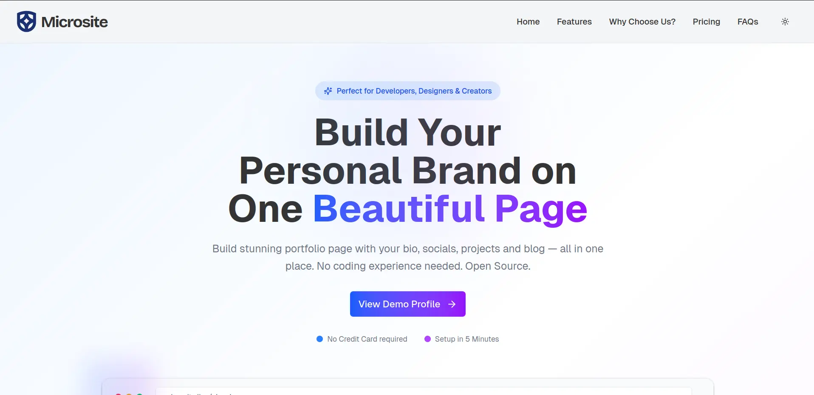

# 🌐 Microsite — An open-source, modern alternative to About.me

Microsite is a no-code, open-source portfolio builder for developers, creators, and professionals. Easily showcase your bio, projects, blog posts, and bookmarks — all in one elegant page.




## 🚀 Features

- Clean responsive layout
- Profile with avatar, bio, and social links
- Projects
- Bookmarks
- Light/Dark theme support

## 🛠️ Tech Stack

- [Next.js](https://nextjs.org/)
- [TypeScript](https://www.typescriptlang.org/)
- [Supabase](https://supabase.com/) (Auth + Database)
- [Tailwind CSS](https://tailwindcss.com/)
- [Shadcn UI](https://ui.shadcn.com/)
- [Motion](https://motion.dev/)

## 🧩 Installation

```bash
# 1. Clone the repo
git clone https://github.com/ahmadgirach/micro-site.git
cd micro-site

# 2. Install dependencies
bun i

# 3. Copy env file and add your credentials
cp .env.example .env

Edit the .env file with your credentials:

```bash
NEXT_PUBLIC_SUPABASE_URL=your-supabase-url
NEXT_PUBLIC_SUPABASE_ANON_KEY=your-supabase-anon-key
SUPABASE_SERVICE_ROLE_KEY=your-supabase-service-role
NEXT_PUBLIC_SITE_URL=http://localhost:3000

GOOGLE_CLIENT_ID=your-google-client-id
GOOGLE_CLIENT_SECRET=your-google-client-secret
```
# 4. Run dev server
bun dev

## 📌 Roadmap

- [ ] Google Auth
- [ ] Projects
- [ ] Testimonials
- [ ] Blog
- [ ] Bookmarks (save & tag links)
- [ ] One click PDF Resume export
- [ ] Analytics
- [ ] Video Introduction
- [ ] Multi Theme

## 📄 License

Licensed under **AGPL-3.0**. See LICENSE for details.

## 🤝 Support

Show your 💖 by starring the repo.